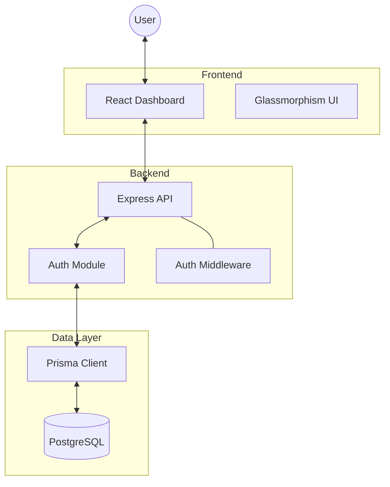
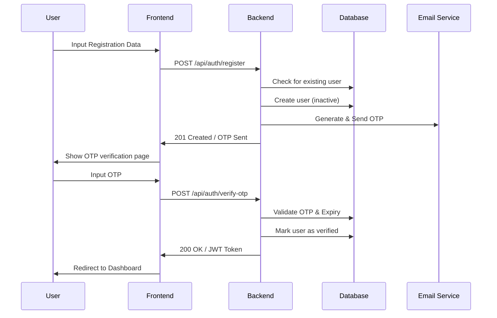
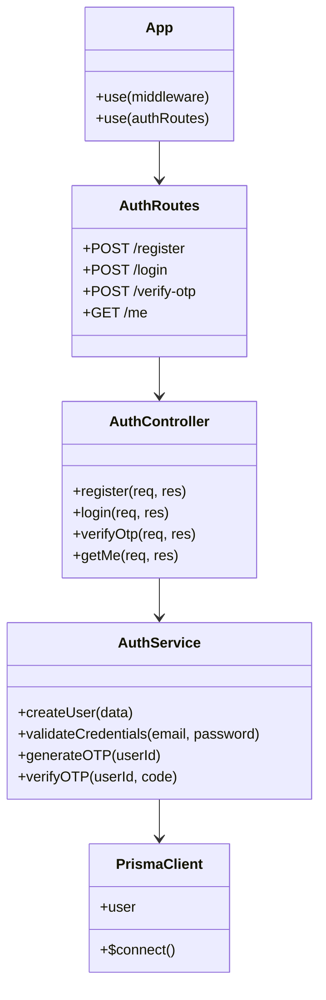

# System Architecture

This document describes the high-level architecture and design of the Hotel Management System (v0.1.2).

## 🏗️ Overview

The system follows a modern monorepo architecture with a clear separation between the frontend and backend. It leverages a micro-module approach for the backend to ensure scalability and maintainability.

### Tech Stack
- **Frontend**: React + Vite + TypeScript
- **Backend**: Node.js + Express
- **Database**: PostgreSQL (via Supabase)
- **ORM**: Prisma
- **Styling**: Vanilla CSS (Premium Glassmorphism)
- **Security**: JWT, Bcrypt, OTP, RBAC

---

## 📊 System Components



---

## 🔄 Sequence Diagram: Authentication & OTP Flow

The following diagram illustrates the secure registration and verification process.



---

## 🏛️ Class Diagram: Backend Module Structure

The backend is structured into logical modules. Each module contains its routes, controller, and service.



---

## 🎭 Use-Case Diagram: Role-Based Access Control (RBAC)

The system defines three primary roles: **Admin**, **Staff**, and **Customer**.

```mermaid
useCaseDiagram
    actor "Admin" as admin
    actor "Staff" as staff
    actor "Customer" as customer

    package "Hotel Management System" {
        usecase "Room Booking" as UC1
        usecase "Payments" as UC2
        usecase "Manage Staff" as UC3
        usecase "View Analytics" as UC4
        usecase "Self Profile Management" as UC5
    }

    admin --> UC1
    admin --> UC2
    admin --> UC3
    admin --> UC4
    admin --> UC5

    staff --> UC1
    staff --> UC2
    staff --> UC4
    staff --> UC5

    customer --> UC1
    customer --> UC2
    customer --> UC5
```

---

## 📂 Directory Structure

```text
root/
├── backend/            # Express API & Prisma
│   ├── prisma/         # Schema & Migrations
│   └── src/
│       ├── modules/    # Feature-based folders
│       └── middleware/ # Security & Validation
├── frontend/           # React + Vite
│   └── src/
│       ├── pages/      # Dashboard & Auth views
│       └── components/ # UI Components
├── docs/               # Technical Documentation
└── utils/              # Shared Utilities
```
