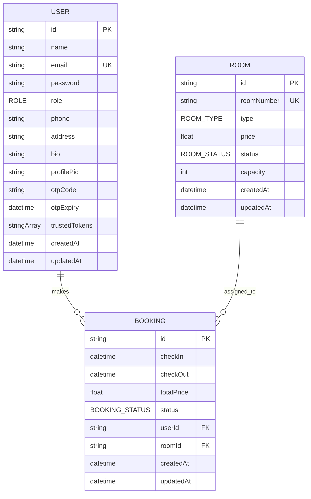

# Database Schema Documentation

This document describes the database schema used by the Hotel Management System (v3.0.0).

## 🗄️ Database Provider
- **Type**: PostgreSQL (via Supabase)
- **ORM**: Prisma

---

## 📊 Models

### 1. User
Stores registration and authentication details for all users (Customers, Staff, and Admins).

| Field | Type | Attributes | Description |
| :--- | :--- | :--- | :--- |
| `id` | `String` | `@id`, `default(uuid())` | Primary Key. Global unique identifier. |
| `name` | `String` | | Full name of the user. |
| `email` | `String` | `@unique` | Unique login email. |
| `password` | `String` | | Hashed password (Bcrypt). |
| `role` | `Role` | `default(CUSTOMER)` | User privileges (Admin, Staff, Customer). |
| `phone` | `String?` | | User phone number. |
| `address` | `String?` | | User home address. |
| `bio` | `String?` | | Short user biography. |
| `profilePic` | `String?` | | URL to the user's profile picture. |
| `otpCode` | `String?` | | Current 6-digit OTP code for verification. |
| `otpExpiry` | `DateTime?` | | Expiration timestamp for the OTP. |
| `trustedTokens` | `String[]` | | List of JWT tokens from trusted devices/browsers. |
| `createdAt` | `DateTime` | `@default(now())` | Record creation timestamp. |
| `updatedAt` | `DateTime` | `@updatedAt` | Record last update timestamp. |

### 2. Room
Stores information about the rooms available in the hotel.

| Field | Type | Attributes | Description |
| :--- | :--- | :--- | :--- |
| `id` | `String` | `@id`, `default(uuid())` | Primary Key. Global unique identifier. |
| `roomNumber` | `String` | `@unique` | Identifying number/name of the room. |
| `type` | `RoomType` | | Category of the room (e.g., DELUXE). |
| `price` | `Float` | | Price per night. |
| `status` | `RoomStatus` | `default(AVAILABLE)` | Current availability status. |
| `capacity` | `Int` | | Maximum number of guests. |
| `createdAt` | `DateTime` | `@default(now())` | Record creation timestamp. |
| `updatedAt` | `DateTime` | `@updatedAt` | Record last update timestamp. |

### 3. Booking
Stores reservations made by users.

| Field | Type | Attributes | Description |
| :--- | :--- | :--- | :--- |
| `id` | `String` | `@id`, `default(uuid())` | Primary Key. Global unique identifier. |
| `checkIn` | `DateTime` | | Reservation start date. |
| `checkOut` | `DateTime` | | Reservation end date. |
| `totalPrice` | `Float` | | Total cost of the stay. |
| `status` | `BookingStatus` | `default(PENDING)` | Current status of the reservation. |
| `userId` | `String` | | Foreign Key to the User model. |
| `roomId` | `String` | | Foreign Key to the Room model. |
| `createdAt` | `DateTime` | `@default(now())` | Record creation timestamp. |
| `updatedAt` | `DateTime` | `@updatedAt` | Record last update timestamp. |

---

## 🎭 Enums

### Role
Defines the access level of a user.

- `CUSTOMER`: Standard guest user. Can book rooms and view own payments.
- `STAFF`: Hotel employee. Can manage bookings, view analytics, and process payments.
- `ADMIN`: Full system access. Can manage staff and view global reports.

### RoomType
Defines the category of a room.

- `SINGLE`: Room for one person.
- `DOUBLE`: Room for two people.
- `DELUXE`: Premium room with better amenities.
- `SUITE`: Luxury multi-room accommodation.

### RoomStatus
Defines the current availability of a room.

- `AVAILABLE`: Ready for booking.
- `BOOKED`: Currently occupied or reserved.
- `MAINTENANCE`: Under repair or cleaning.

### BookingStatus
Defines the current state of a reservation.

- `PENDING`: Waiting for manual confirmation or payment.
- `CONFIRMED`: Reservation is active and valid.
- `CANCELLED`: User or system cancelled the reservation.
- `COMPLETED`: Guest has checked out and the stay is over.

---

## 🗺️ Visual Representation

